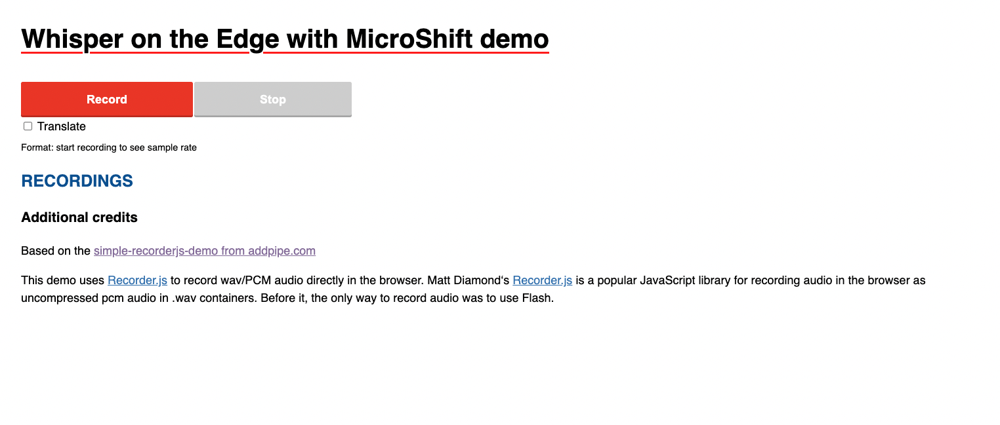

# Whisper at the Edge with MicroShift

This repository contains all the artifacts needed to run the demo "Whisper at the Edge with MicroShift" developed by Miguel Angel Ajo and Ricardo Noriega.

The end goal of this demo is to show a GPU intensive workload such as the [OpenAI Whisper model](https://openai.com/research/whisper) running on an Edge Device such as the NVIDIA Jetson Xavier NX in a cloud native manner using [MicroShift](https://next.redhat.com/2022/01/19/introducing-microshift/).

The entire presentation shown at the OpenShift Commons 2023 EU event talked about how to build edge-optimized operating system images that contain all the necessary components to run an AI/ML workload at the edge, including the GPU drivers, container runtime, MicroShift and even the application itself.

This repository only contains the application running on top of MicroShift, and we will assume that the consumer of this demo already has a running device.

## Building the containerized application

Python 3.10 is a hard requirement when it comes to build this application. Once it is installed in your host, let's install the rest of the requirements:

```bash
pip3.10 install -r webapp/requirements.txt
```

The webapp directory contains a Makefile that helps with building the application and other tasks:

```bash
cd webapp/
make build
```

This task will download the Whisper model in its small variant from the OpenAI website and will build the container image. The default image tag as its reflected in the Makefile and the deployment manifest is `quay.io/mangelajo/nv-whisper-edge:latest`. In order to build the application and the container image just execute the following command:

```bash
make build
```

If you want to change the image tag and location, you need to add the IMAGE_TAG variable as the following example:

```bash
make build IMAGE_TAG=quay.io/myuser/my-whisper:latest
```

If you want to push the image to that container registry, you just use the `push` target:

```bash
make push IMAGE_TAG=quay.io/myuser/my-whisper:latest
```

NOTE: If the default IMAGE_TAG is modified, you will need to change line 27 of the file `deployment/deployment.yaml` accordingly.

## Apply the Kubernetes manifests

This repository contains a set of Kubernetes manifests to be applied. These manifests will create a deployment with only one replica of the application, a service and a route. MicroShift provides an mDNS resolver for routes within the local domain, and the route provided by the `mdns_route.yaml` manifest will be resolved automatically.

Assuming you have access to your edge device where MicroShift is running, copy all files to the following location and restart MicroShift:

```bash
cp deployment/* /etc/microshift/manifests/
systemctl restart microshift
```

After few seconds, the application will be reachable from your browser (if your machine is located in the same layer 2 domain as the edge device) in the following URL:

```bash
http://whisper.local
```

The web application looks like this:



Now, it's ready to hit the Record button so you can start speaking in your mother tongue to get it transcribed into the web page. If you click on the "Translate" checkbox, it will simultaneously translate it to English.

## Conclusions

This simple application is developed to showcase the power of a small edge device with integrated GPUs as the NVIDIA Jetson Xavier NX. The code is ready to detect a CUDA device in order to run the Whisper AI model, otherwise it will run on the machine CPU. An interesting experiment will be to compare the results of running this same application on a GPU-less machine vs a NVIDIA Jetson board.

## References

- https://github.com/addpipe/simple-recorderjs-demo
- https://github.com/mattdiamond/Recorderjs
- https://github.com/openai/whisper


